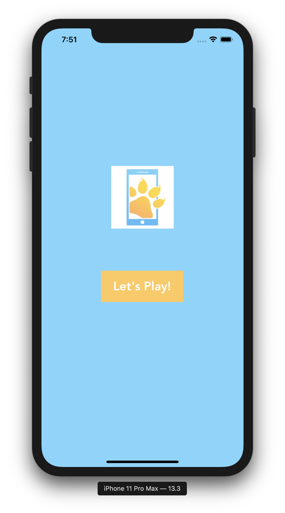
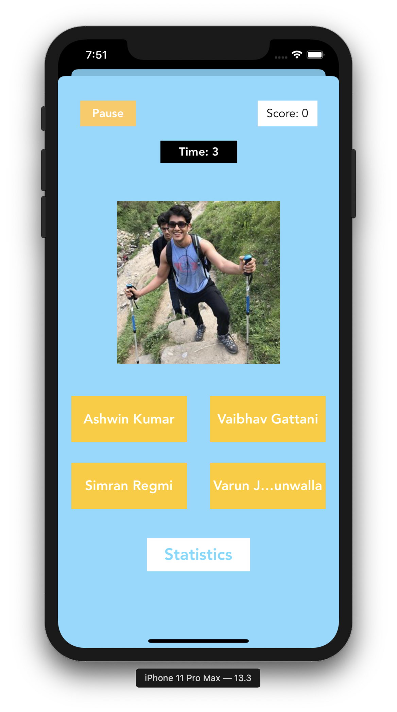
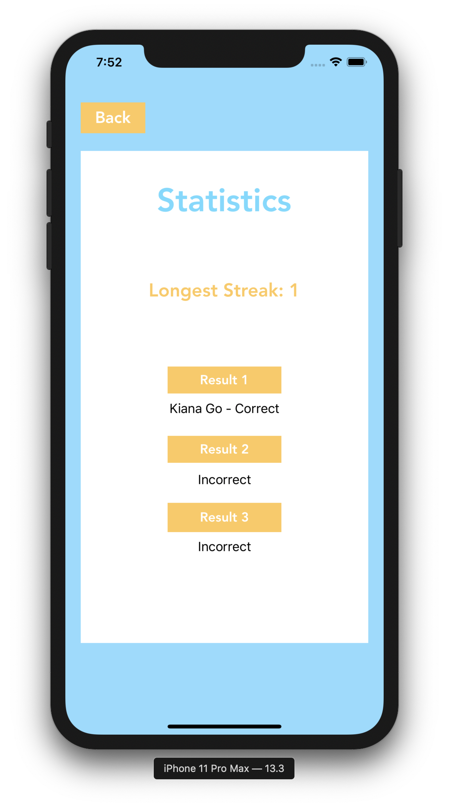

# MeetTheMembers
This is my first project for Mobile Developers of Berkeley! I had lots of fun figuring out the in's and out's of navigation, functions, and more. This overall was a very interesting learning curve that I found useful. Things I would do differently next time is focus more on the scaling and constraints of the components, and figure out how to make this app look a bit fancier.

## Screen 1

This is the starter screen.

## Screen 2

This is the main game! Click away to find the members' names.

## Screen 3

This is the stats screen! Check out how you're doing and your longest streak.
